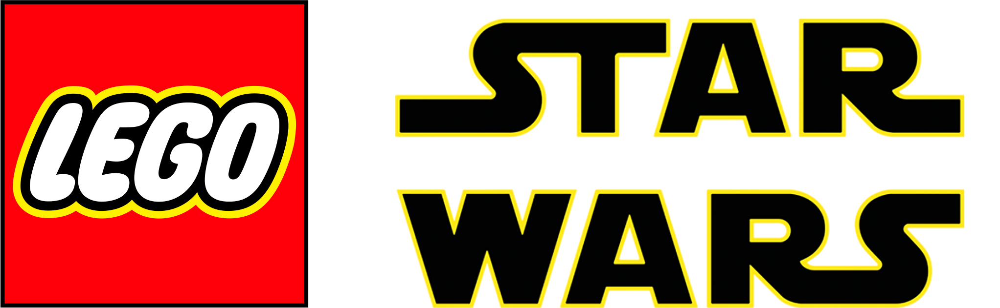

<div align=center>



</div>
<h1 align=center>LEGO Star Wars: The Force Awakens · Switch Port</h1>

A wrapper/port of the Android release of LEGO Star Wars: The Force Awakens
(`com.wb.goog.legoswtfa`, **v2.2.1.06**). It loads the original game binary
`libProject_Douglas_HH.so` (WB Games "Fusion" engine), relocates and patches it,
and runs it inside a minimal Android-like environment natively on the Switch.

### How to install

You need the **v2.2.1.06** Android release of LEGO Star Wars: The Force
Awakens. From your own legally-owned copy:

1. `libProject_Douglas_HH.so` — from `lib/arm64-v8a/` inside the APK.
2. The game data — the APK's `assets/` contains `assetpack1`, `assetpack2`,
   `assetpack3`. Extract each one and merge the
   contents of them into a single `gamedata/` folder.
   You should end up with `gamedata/` holding the `.fib`
   packs, `cutscenes/`, `music/`, etc.

To install on the SD card, create a folder `lswtfa` inside `/switch/` and copy:

```
/switch/lswtfa/
  lswtfa_nx.nro              (this homebrew)
  libProject_Douglas_HH.so  (arm64 game binary, v2.2.1.06)
  gamedata/                 (extracted game assets — *.fib, cutscenes/, music/, ...)
```

### Notes

This will not run in applet/album mode — it needs the full memory of a game
override. Launch it by holding **R** while opening an installed title, or use a
forwarder.

The port reads `/switch/lswtfa/config.txt`, created on first run:

* `screen_width` / `screen_height` — render resolution; `-1` auto-picks
  1280x720 handheld / 1920x1080 docked.
* `show_fps` — `1` draws a small FPS counter in the top-left corner.

### How to build

Install the devkitPro Switch toolchain and portlibs:

```sh
pacman -S devkitA64 switch-tools libnx switch-sdl2 switch-mesa \
          switch-libdrm_nouveau switch-ffmpeg
```

### Credits

* TheOfficialFloW for the original Android so-loader (gtasa_vita).
* gm666q for the PS Vita so-loader work and the OpenSL ES build.
* fgsfds for max_nx / the Switch so-loader groundwork.

### Support

If you enjoy my work and want to support me :

[](https://ko-fi.com/D1D1P2MOG)

### Legal

This project has no affiliation with TT Games, Warner Bros., Disney, or
Lucasfilm. "LEGO Star Wars: The Force Awakens" and related marks belong to their
respective owners. No assets or program code from the original game or its
Android port are included here. We do not condone piracy; users must own a legal
copy of the game.

Unless noted otherwise, the source in this repository is under the MIT License
(see LICENSE). The vendored `lib/opensles` is Apache-2.0 (AOSP).
